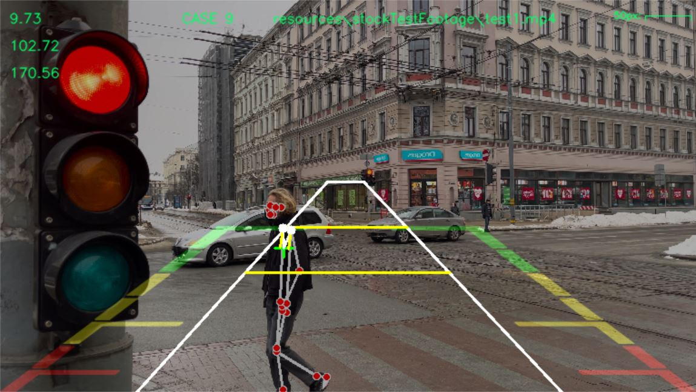
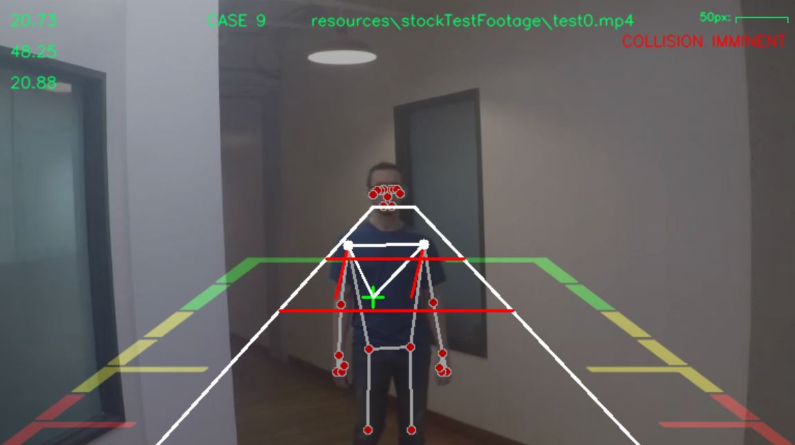
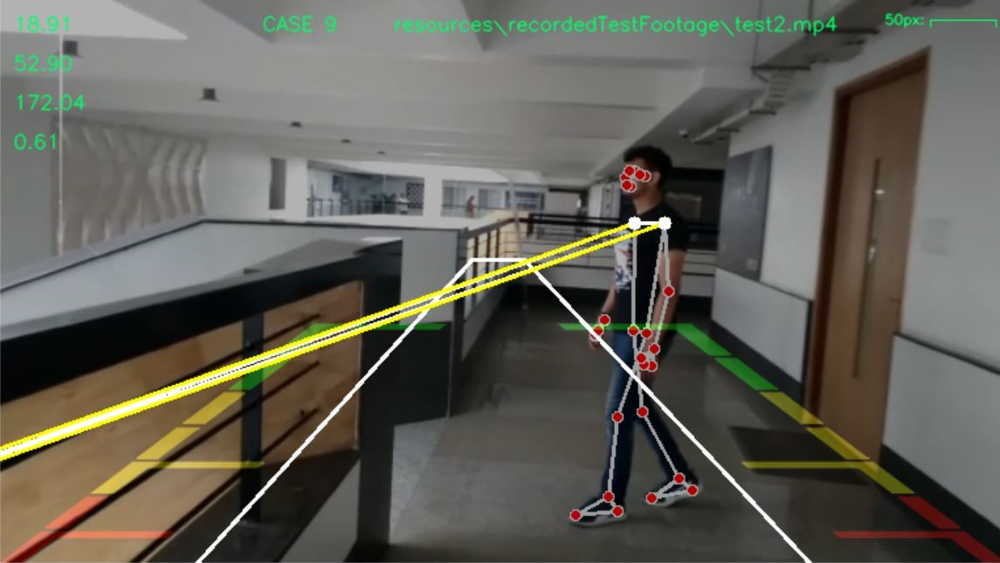
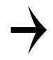
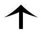

# pedestrian-intention-fuzzy-classifier
A research project repository containing algorithms to classify pedestrian obstruction probabilities into fuzzy logic states using 2D cameras.

#### Title : Fuzzy Pedestrian Intention Classification using Kalman Filtered Quaternion based Pose Estimation



### Abstract 
The purpose of this project is to provide a proof of concept for a novel vision algorithm design methodology that avoids the issue of precise depth perception altogether and instead focuses solely on the processing of projections of a real-world scene.

The reasoning behind the development of such algorithms is primarily to reduce the latency to detect and collect actionable intelligence. To demonstrate the need for the same, we've picked up the specific use case of pedestrian intention classification in autonomous robots.

The algorithm developed as a result of these efforts classifies the possible direction of pedestrian obstacle movement into nine different cases implemented as fuzzy states (outlined later in the document) with respect to their apparent motion on the 2D frame. 

The attached source codes in this repository intend to test the proposed algorithm with a single pedestrian obstacle at a time. This decision will be elaborated on in future sections concerning the future scope of the algorithm as well as testing conditions.

### Setup instructions
To set up this repository on a local system and test out the algorithm ...

1. Assuming the existence of an up-to-date pip installer, python and git on the system (defaults for both Windows 11 and Ubuntu 20.04), execute the following command in the terminal of the preferred environment -

    ```pip3 install numpy matplotlib pandas opencv-python mediapipe ```


2. Navigate to a preferred directory by entering the following command in the chosen shell as such -

    ```cd <absolute path to the directory>```


3. Clone the repository by executing the following command -

    ```git clone https://github.com/SR42-dev/pedestrian-intention-fuzzy-classifier.git```
    
    Note to self : This command will have to be updated based on the location of the remote repository as well as it's publicity status.


4. Navigate to the repository by executing the following command on the aforementioned shell -

    ```cd pedestrian-intention-fuzzy-classifier```

    Note to self : This command will have to be updated based on the name of the remote repository.


5. Create a new directory under ./resources named 'stockTestFootage' and download the test .mp4 files on the following drive link into it -

   ```<insert drive link here>```


6. Execute the three source codes provided as such -

   ```python singlePedestrianCollisionPredictionv1.0.py```


   

   
   ```python singlePedestrianPathIntersectionv1.1.py```
   

   


   ```python singlePedestrianPathPredictionv3.1.py```


   


### Algorithm

The algorithm developed operates in a sequential manner but it is acknowledged that this can be optimized using multithreading and parallel processing techniques.
The general steps for detection and action determination occur as follows ...

- The pose of an arbitrarily selected pedestrian present in the frame is detected using the mediapipe framework.
- A rotation matrix is generated from the locations of the shoulder points extracted from the pose.
- A quaternion is generated from the aforementioned rotation matrix.
- The angle between the perpendicular from the midpoints of the shoulder in the direction being faced bby the pedestrian and the horizontal is calculated as the angle of orientation.
- This angle value is passed through a dynamic 1D Kalman filter for noise reduction purposes.
- Now, the components of the velocity vector of the pedestrian projection on the 2D frame is generated in terms of movement in pixels per second (the units of measurement haven't been given much emphasis due to their being factored in the classification stage).
- These components are passed through a streaming average filter (choice over Kalman filter based on emperical reasons) to reduce noise.
- The filtered values of velocity and angle of orientation are projected back on the 3D cartesian space based on their fuzzy logic state.
- This projection is again represented on the 2D frame in the form of a future X, Y location.

The three source codes given are essentially visualizations of the same algorithm in different formats.

### Utilized fuzzy state descriptions 

The fuzzy state classification has been implemented using 9 possible states of movement :

1. State 1 (CASE 1) - The case covering movements toward the top right of the frame (i.e.; away and to the right of the single camera's perspective).
   

   
   

2. State 2 (CASE 2) - The case covering movements toward the bottom left of the frame (i.e.; toward and to the left of the single camera's perspective).


   
   

3. State 3 (CASE 3) - The case covering movements toward the bottom right of the frame (i.e.; toward and to the right of the single camera's perspective).


   
   

4. State 4 (CASE 4) - The case covering movements toward the top left of the frame (i.e.; away and to the left of the single camera's perspective).


   
   

5. State 5 (CASE 5) - The case covering movements toward the right of the frame (i.e.; to the right of the single camera's perspective).


   
   

6. State 6 (CASE 6) - The case covering movements toward the left of the frame (i.e.; to the left of the single camera's perspective).


   
   

7. State 7 (CASE 7) - The case covering movements toward the top of the frame (i.e.; away from the single camera's perspective).


   
   

8. State 8 (CASE 8) - The case covering movements toward the bottom of the frame (i.e.; towards the single camera's perspective).


   
   

9. State 9 (CASE 9) - The edge case for a lack of significant movement requiring prediction of a location seperate from the future reality.


   
   


### Future scope 

This section contains the authors' notes for the future scope of and improvements to the algorithm and code in general.

1. The programs can be made to evaluate multiple pedestrians at the same time by extracting each individual bounding box in a seperate thread and executing the algorithm individually for each.
2. The output can be presented better using a flask based interface.
3. Point 1 caps out processing power based on the number of cores present on the system. GPU utilization and CUDA optimization would help for this purpose due to the higher importance of throughput for this use case.
4. It would be desirable to test this on an actual autonomous robot with a single forward facing camera feed.